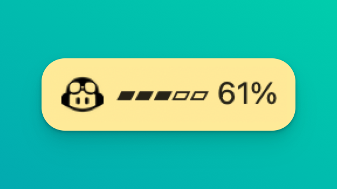

# GitHub Copilot Usage Tracker

A system tray application built with Tauri that displays your GitHub Copilot
metered usage with real-time percentage bars for Premium requests, and your
Claude subscription usage. Pick which one the menu bar shows from the tray menu.

<div align="center">
  
  <p><em>Monitor your GitHub Copilot usage effortlessly</em></p>
</div>

## Features

- **System Tray Integration**: Lives in your system tray for quick access
- **Two Sources**: Switch the menu bar between **GitHub Copilot** and **Claude**
  from the tray menu or the in-app tabs
- **Usage Visualization**: Visual progress bars showing Premium request usage
  (Copilot) or session and weekly limits (Claude)
- **Menu Bar Display Options**: Toggle the ascii bar, the percentage, and the
  raw premium request count (`used/total`) independently
- **License**: Shows which GitHub Copilot plan the account is on (Free, Pro,
  Pro+, Business, Enterprise) in the app and the tray menu
- **Auto-Refresh**: Automatically updates usage data every 5 minutes
- **Secure Token Storage**: Stores your GitHub token locally
- **Authentication Options**: Choose between automated GitHub OAuth or manual
  token entry
- **Cross-Platform**: Works on macOS, Windows, and Linux

## Prerequisites

- Node.js (v20 or higher)
- Rust (latest stable version)
- GitHub account with Copilot access (for automated authentication) or a
  Personal Access Token
- For Claude usage: the [Claude Code](https://claude.com/claude-code) CLI,
  signed in on the same machine

If Rust is installed via `rustup`, make sure a toolchain is configured before
running Tauri:

```bash
rustup default stable
```

Optional (repo-local instead of changing your global default):

```bash
rustup override set stable
```

If no toolchain is configured, `tauri dev` fails while running `cargo metadata`
with an error like `rustup could not choose a version of cargo to run`.

### Linux (Ubuntu/Debian)

Tauri on Linux requires a few system libraries (GTK + WebKit) for the Rust
backend to compile.

```bash
sudo apt-get update
sudo apt-get install -y pkg-config libgtk-3-dev libwebkit2gtk-4.1-dev libayatana-appindicator3-dev
```

## Getting Started

### Installation

```bash
npm install
```

### Development

```bash
npm run tauri dev
```

### Build

```bash
npm run tauri build
```

## Usage

1. Launch the application
2. Choose your authentication method:
   - **Automated Authentication**: Click "🔑 Login with GitHub" to start the
     OAuth flow. Your browser will open to authorize the app, then enter the
     provided code when prompted.
   - **Manual Token Entry**: Enter your GitHub Personal Access Token directly
3. The app will fetch and display your Copilot usage and licence
4. Click the system tray icon to show/hide the usage window
5. Usage data refreshes automatically every 5 minutes

### Menu bar display

Three checkboxes control what the menu bar shows, and the choice is remembered:

- **Show bar** — the ascii progress bar, e.g. `▰▰▰▰▱`
- **Show percent** — the used percentage, e.g. `45%`
- **Show count** — the raw premium request count, e.g. `649/20000`
  (GitHub Copilot only; Claude reports percentages only)

## Authentication Setup

### Automated GitHub OAuth (Recommended)

The app uses GitHub's device code OAuth flow for secure authentication:

1. Click "🔑 Login with GitHub" in the app
2. Your default browser will open to GitHub's authorization page
3. Enter the displayed user code when prompted
4. Grant permission for Copilot access
5. The app will automatically receive and store your access token

### Manual Token Entry

If you prefer to use a Personal Access Token:

1. Create a token at: https://github.com/settings/tokens
2. Ensure it has the `copilot` scope (required for Copilot usage data)
3. Enter the token in the app's input field
4. Click "Save Token"

**Note**: The automated flow is recommended as it handles token refresh and uses
the correct scopes automatically.

## Claude Usage

Claude usage reuses the login the Claude Code CLI already keeps on your machine,
so there is no separate sign-in:

1. Sign in once with the Claude Code CLI (run `claude`, then `/login`)
2. Pick **Claude** in the tray menu under "Show usage for", or the in-app tab
3. The app shows your session (5-hour) and weekly limits with reset times

The menu bar shows the window closest to its limit — the one that will actually
cut you off first — while the dropdown breaks out each window individually.

Credentials are read fresh on every refresh (macOS Keychain, or
`~/.claude/.credentials.json` elsewhere). The app never refreshes the token
itself; Claude Code owns that, so if the login expires just run the CLI once.
The first refresh on macOS asks for permission to read the Keychain item.

**Note**: the endpoint behind this is the same undocumented one the Claude Code
CLI uses for its own `/usage` display. It is not a supported public API and may
change.

## Tech Stack

- **Frontend**: React + TypeScript
- **Backend**: Tauri (Rust)
- **Build Tool**: Vite
- **APIs**: GitHub Copilot Internal API, Anthropic OAuth usage endpoint

## License

MIT
